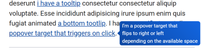
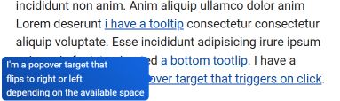
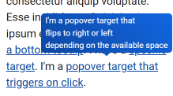

> HTML as it should be, even on older browsers

`modern-now` is a html enhancement library that provides common js powered
elements.

At its core, it started by [adding dynamic support for the dialog element](https://blog.lekoala.be/using-dialog-elements-today).

It's very simple and can be easily extended with your own features.

## Dialog

### Intro

Add [`dialog-polyfill`](
https://github.com/GoogleChrome/dialog-polyfill) dynamically if needed and register it using `qsa-observer`.

Provides extra button controls for the js dialog api and animation.

### Css

Don't forget that `dialog::backdrop` will drop the entire rule on browsers
not supporting this, so you need two rules.

```css
dialog::backdrop {
  /* native */
  background-color: green;
}
dialog + .backdrop {
  /* polyfill */
  background-color: green;
}
```

## Tooltips

Add `data-tooltip` to any element to get nice tooltips with dynamic placement.
Placement is made by our home made floating utils, inspired by floating ui.

Css is dynamically inserted and can be adjusted with css variables.

Positioning will be done according to available size, for example:



 

 

## Other features included in full build

See demos for more informations

- Behaviour : attach dynamic behaviour to any element
- Dropdowns : accessible, dynamically positioned dropdowns positioned with our floating utils
- Forms : ajax and validation for forms
- Inputs : input form helpers (file, autogrow, limited, mask, bound, toggle)
- Calendar: dynamic calendars and date inputs
- Mark : dynamically animated `mark` elements
- Time : format time using i18n formatters
- Number : format numbers (eg: currencies) using i18n formatters
- Toggle : hide/show elements
- Hx : htmx like elements that can trigger fetch requests
- Cmd : elements that trigger functions on click

## Builds

You can either have:

  dist\full.js        51.9kb
  dist\tooltip.js     12.2kb
  dist\formatters.js   6.4kb
  dist\dialog.js       6.2kb

Solo builds are only provided if the component is not using nonchalance.

It's also very easy to make your own build and leverage the utils to make your
js code much friendlier in your own project.

## Browser Support

Basically anything supporting module and [dynamic imports](https://caniuse.com/es6-module-dynamic-import)

- Firefox 67+ (2019-05)
- Chrome 63+ (2017-12)
- Edge 79+ (2020-01)
- Safari 11.1+ (2018-03)
 